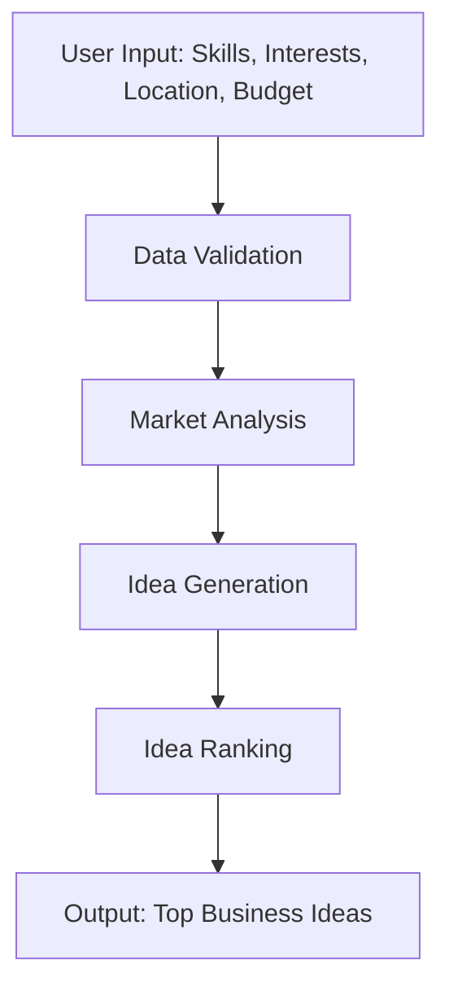
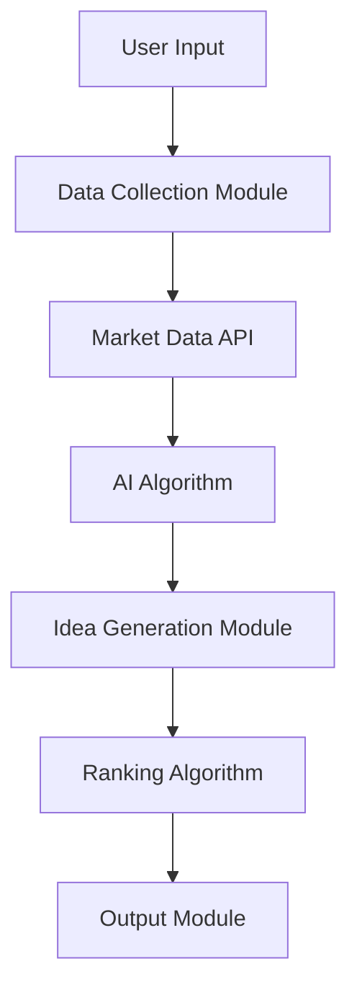

Artificial Intelligence Business Idea Generator App

Table of Contents

1. Introduction
2. System Overview
3. User Prompts and System Instructions
4. Diagrams
   · Chat Flow Diagram
   · Data Flow Diagram
5. Data Flow with Formulas
6. Alignment with Vocational Rehabilitation and Workforce Development
7. Made in America Philosophy
8. Cost-Effective and Sustainable Growth
9. Market Readiness and Combatting the Fear Pandemic
10. Conclusion

---

1. Introduction

The Artificial Intelligence Business Idea Generator App is designed to help users generate viable business ideas that align with current economic trends, vocational rehabilitation, workforce development, and the "Made in America" philosophy. The app leverages AI to provide personalized business ideas that are cost-effective, sustainable, and ready for market deployment. It aims to combat the "fear pandemic" by empowering users with actionable and feasible business solutions.

---

2. System Overview

The app uses a combination of Natural Language Processing (NLP), Machine Learning (ML), and data analytics to generate business ideas. It takes user inputs such as skills, interests, location, and budget, and combines them with market trends, grant opportunities, and loan availability to suggest business ideas.

Key Features:

· Personalized Business Ideas: Tailored to user's skills, interests, and financial capacity.
· Grant and Loan Integration: Identifies potential grants and loans available during 2025-2030.
· Vocational Alignment: Aligns with vocational rehabilitation and workforce development programs.
· Made in America: Focuses on businesses that support local manufacturing and services.
· Sustainability: Ensures ideas are environmentally sustainable and cost-effective.

---

3. User Prompts and System Instructions

User Prompts:

1. Skills and Interests: "What are your key skills and interests?"
2. Location: "Where do you plan to start your business?"
3. Budget: "What is your initial budget for the business?"
4. Industry Preference: "Do you have a preferred industry or sector?"
5. Sustainability Goals: "What are your sustainability goals for the business?"

System Instructions:

1. Data Collection: Collect user inputs and validate them.
2. Market Analysis: Analyze current market trends, grant opportunities, and loan availability.
3. Idea Generation: Use AI algorithms to generate business ideas based on user inputs and market analysis.
4. Idea Ranking: Rank ideas based on feasibility, cost, sustainability, and alignment with "Made in America."
5. Output: Present the top 3-5 business ideas with detailed plans, including potential grants and loans.

---

4. Diagrams

Chat Flow Diagram

Data Flow Diagram

---

5. Data Flow with Formulas

Idea Generation Formula

The AI algorithm uses a weighted sum model to generate business ideas:

\text{Idea Score} = w_1 \times \text{Skill Match} + w_2 \times \text{Market Demand} + w_3 \times \text{Sustainability Score} + w_4 \times \text{Cost Feasibility}

Where:

· w_1, w_2, w_3, w_4 are weights assigned to each factor.
· Skill Match: How well the idea matches the user's skills.
· Market Demand: Current demand for the product/service.
· Sustainability Score: Environmental impact and sustainability.
· Cost Feasibility: Initial budget required vs. user's budget.

Ranking Formula

Ideas are ranked based on their Idea Score and alignment with "Made in America":

\text{Final Score} = \text{Idea Score} \times \text{Alignment Factor}

Where:

· Alignment Factor: A multiplier based on how well the idea aligns with "Made in America" and vocational rehabilitation goals.

---

6. Alignment with Vocational Rehabilitation and Workforce Development

The app ensures that generated business ideas align with vocational rehabilitation and workforce development programs by:

· Skill Matching: Ensuring the business idea leverages the user's existing skills.
· Training Opportunities: Identifying additional training or certifications needed.
· Job Creation: Focusing on ideas that can create local jobs and support workforce development.

---

7. Made in America Philosophy

The app prioritizes business ideas that:

· Support Local Manufacturing: Encourage the use of local suppliers and manufacturers.
· Create Local Jobs: Focus on businesses that can employ local talent.
· Promote American Products: Highlight products and services that are made in the USA.

---

8. Cost-Effective and Sustainable Growth

The app ensures that all generated business ideas are:

· Cost-Effective: Within the user's budget and with a clear path to profitability.
· Sustainable: Environmentally friendly and aligned with long-term sustainability goals.
· Scalable: Capable of growing over time without significant additional investment.

---

9. Market Readiness and Combatting the Fear Pandemic

The app is designed to be user-friendly and ready for market deployment quickly. It aims to combat the "fear pandemic" by:

· Empowering Users: Providing actionable and feasible business ideas.
· Reducing Uncertainty: Offering clear steps and resources to start a business.
· Building Confidence: Helping users feel confident in their ability to succeed.

---

10. Conclusion

The Artificial Intelligence Business Idea Generator App is a powerful tool for anyone looking to start a business in America. It aligns with current economic trends, vocational rehabilitation, and the "Made in America" philosophy, ensuring that users can generate viable, sustainable, and cost-effective business ideas quickly and easily. By leveraging AI, the app empowers users to overcome the fear pandemic and take control of their economic future.

---

This markdown document provides a comprehensive overview of the AI Business Idea Generator App, including its features, user prompts, system instructions, diagrams, data flow, and alignment with key economic and social goals.